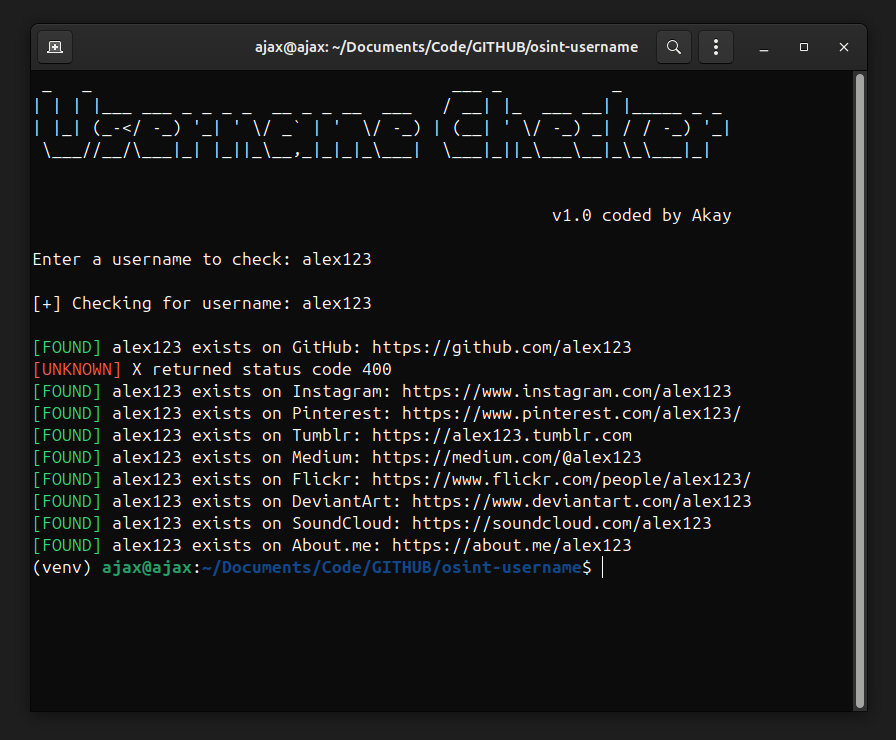

# Username Checker!

---

**Username Checker** is a simple Python-based tool that helps you check the availability of a username across various popular social media platforms and websites using basic OSINT (Open Source Intelligence) techniques.

---

## Features

- Check for username presence on more than 10 popular platforms including GitHub, X (Twitter), Instagram, Pinterest, and more.
- Color-coded terminal output for status (Found, Not Found, Error).
- Eye-catching ASCII banner using pyfiglet.
- Interactive loading bar on startup.
- Fast and efficient HTTP requests using `requests.Session()`.

---

## Installation

1. Clone this repository or download the script.

2. Make sure Python 3 is installed on your system.

3. Install the required dependencies:

```
pip install -r requirements.txt
```

---

### (Optional but Recommended) Create a Virtual Environment

For Linux/macOS:
```
python3 -m venv venv
source venv/bin/activate
```
For Windows:
```
python -m venv venv
venv\\Scripts\\activate
```

---

### Usage

Run the script:

```
python3 username.py
```

Then enter the username you want to check when prompted.

---

## Output



---

## Code Structure

- `loading_bar()` — Displays a progress bar during startup.
- `clear_screen()` — Clears the terminal before showing the banner.
- `print_banner()` — Displays the banner using pyfiglet in white text.
- `load_platforms(username)` — Returns a dictionary of platforms and profile URLs.
- `check_username(username)` — Sends HTTP GET requests and prints the result.

---

## ⚠️ Disclaimer ⚠️

This tool is created **For educational purposes only**.  
Misuse of this tool for stalking, unauthorized surveillance, or any form of malicious activity is strictly prohibited.  
The creator is not responsible for any misuse or damage caused by this software.
**This tool is still under repair!**

---

## License

MIT License
